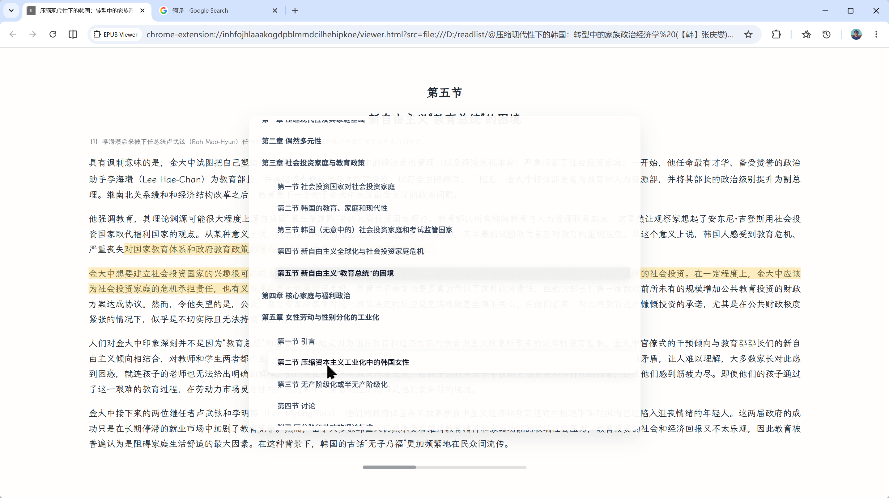

# epub.ts

A web-based EPUB reader available as:

- A Chrome extension
- A web app
- A browser-powered desktop app

## Features

- Single- and double-column layouts
- Adjustable font size
- Controls for content width, line spacing, letter spacing, and image size
- Code highlighting powered by highlight.js
- Image zooming and copying powered by medium-zoom
- Math rendering and copying powered by MathJax
- Highlights and annotations
- Table of contents and reading progress
- Full-text search

Table of contents:



Search:


Auto-hiding Dock toolbar:


### Runtime support

Supports Chrome and Edge 152+, Firefox 154+, and Safari and iOS Safari 26+.
The app uses modern Web APIs directly, with no polyfills or fallbacks for older releases.
See the Browserslist in `package.json` for the canonical build targets.

Clipboard and local-file features require a secure context and user permission.
Translation runs entirely on the device and requires a browser with the built-in Translator API.

### Advanced settings

Less frequently used options are available through `epub.settings` in the developer console and are stored in the browser's `localStorage`:

```js
epub.settings.fonts
epub.settings.textAlignment
epub.settings.translationTargetLanguage

await epub.settings.setSerifFont("Noto Serif, serif")
await epub.settings.setSansFont("Noto Sans, system-ui, sans-serif")
await epub.settings.setMonoFont("Fira Code, ui-monospace, monospace")
await epub.settings.setTextAlignment("justify") // "auto" | "start" | "justify"
await epub.settings.setTranslationTargetLanguage("ja") // BCP 47 language tag
await epub.settings.reset()
```

Font names refer only to locally available browser fonts; the app does not download or install fonts.
The `auto` text-alignment setting chooses an alignment based on the document language.
The translation target defaults to the browser's preferred language. If support for a language pair is not installed, its model is downloaded only after confirmation in the translation popover.
`reset()` removes all advanced overrides and restores the defaults.
On each launch, the app logs the current settings and command hints to the console.

Translation languages use [BCP 47](https://www.rfc-editor.org/info/bcp47) tags, including `zh-Hans` for Simplified Chinese and `zh-Hant` for Traditional Chinese.
See the [official Edge language list](https://github.com/MicrosoftEdge/Demos/blob/main/built-in-ai/static/translator-api.js) or use the [Edge Built-in AI Playground](https://microsoftedge.github.io/Demos/built-in-ai/) to check model availability.
The reader uses the EPUB `lang` value when available and invokes the Language Detector only when it is missing.

### Application variants

Key platform differences:

| Application | Opening local EPUBs | Saving |
| --- | --- | --- |
| Extension | Select or drop a file on the welcome screen, or open a `file://*.epub` tab and be redirected to the reader | Saves the complete EPUB through a file picker and reuses approved file handles |
| Web | Select or drop a file; OS file associations are unavailable | Files opened through the picker can be saved directly; dropped files are saved as downloaded copies |
| Desktop | Launch without arguments to show the welcome screen, or open a file through an OS file association | Associated files are written back by the local service; files selected on the welcome screen use browser-based saving |

Dropping support for old browsers does not mean dropping support for old books.
The parser and typography layers retain common EPUB 2 and EPUB 3 repairs, including legacy namespaces and `xlink:href`, `-epub-*` CSS normalization, irregular metadata, and migration of existing annotation data.
These paths preserve publication compatibility, not obsolete browser runtimes.


## Shortcuts

| Input | Paginated | Scrolled |
| --- | --- | --- |
| Click the left or right side of the screen | Previous or next column | Previous or next screen |
| Mouse Back or Forward button | Previous or next screen in reading order | Previous or next screen in reading order |
| `Left` / `Right`, `h` / `l` | Previous or next column | Previous or next screen |
| `Up` / `Down`, `k` / `j` | Previous or next screen | Scroll up or down |
| `Space` | Not applicable | Scroll down |
| Open the table of contents | `t` | `t` |
| Open search | `/` | `/` |
| Go to a reading position | Enter a percentage followed by `G`, such as `50G` | Same |
| Return to the previous position | `Ctrl+O` | `Ctrl+O` |
| Save | `Ctrl+S` / `Command+S` | Same |

## Acknowledgements

- [foliate-js](https://github.com/johnfactotum/foliate-js) for the original renderer and EPUB parser
- Fonts: EB Garamond, Monaspace Argon, Noto Sans, and Noto Serif
